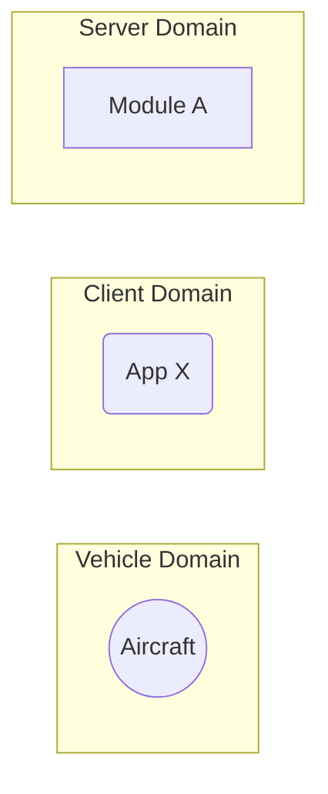

# Software Design Document (SDD) - `lib-FIXME` 

## Overview

This document details the software implementation of FIXME.

This library is responsible for FIXME

Attribute | Description
--- | ---
Status | Draft

## Related Documents

Document | Description
--- | ---
:construction: High-Level Concept of Operations (CONOPS) | Overview of Arrow microservices.
:construction: High-Level Interface Control Document (ICD) | Interfaces and frameworks common to all Arrow microservices.
:construction: Requirements - `svc-FIXME` | Requirements and user stories for this microservice.
[Concept of Operations - `svc-FIXME`](./conops.md) | Defines the motivation and duties of this microservice.
[Interface Control Document (ICD) - `svc-FIXME`](./sdd.md) | Defines the inputs and outputs of this microservice.

## Module Attributes

Attribute | Applies | Explanation
--- | --- | ---
Safety Critical | ? | 
Realtime | ? |

## Global Variables

**Statically Allocated Queues**

FIXME

## Interfaces

For a refresher of the processes in the Arrow backend, please see the [top level README.md](../README.md).

FIXME description of the graph.

## Tests

FIXME

### Unit Tests

FIXME
